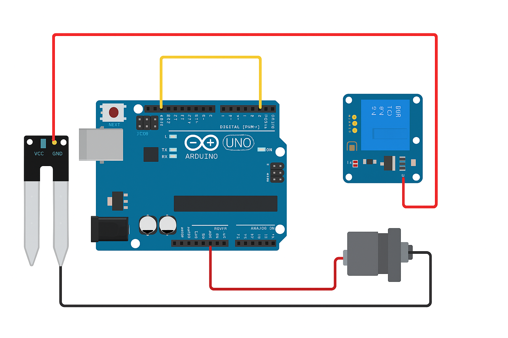

# 🌱 Automatic Plant Watering System using Arduino UNO

This project automates the process of watering plants using a **soil moisture sensor** and **relay-controlled water pump**. The system ensures optimal soil moisture and conserves water by activating the pump only when required.

---

## 🔧 Components Used
- Arduino UNO  
- Soil Moisture Sensor  
- 5V Relay Module  
- Water Pump  
- Jumper Wires  
- Breadboard  
- Power Supply

---

## ⚙️ Working Principle
1. The soil moisture sensor monitors the soil's humidity level.  
2. When the soil becomes dry (below threshold), Arduino triggers the relay.  
3. The relay switches on the water pump.  
4. When soil moisture returns to normal, the pump automatically turns off.



## 💻 Arduino Code
```cpp
int sensorPin = A0;
int relayPin = 8;
int sensorValue = 0;

void setup() {
  pinMode(relayPin, OUTPUT);
  Serial.begin(9600);
}

void loop() {
  sensorValue = analogRead(sensorPin);
  Serial.println(sensorValue);

  if(sensorValue < 400) {
    digitalWrite(relayPin, HIGH); // turn on pump
  } else {
    digitalWrite(relayPin, LOW);  // turn off pump
  }
  delay(1000);
}
